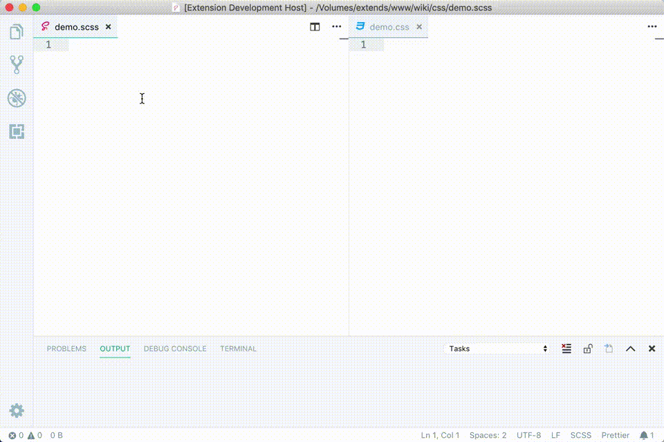

# scss-to-css
> 可用于对scss文件进行简单的编译/压缩, 而不用安装各种前端工程化工具(webpack等)。

[](https://marketplace.visualstudio.com/items?itemName=yutent.scss-to-css)
[](https://marketplace.visualstudio.com/items?itemName=yutent.scss-to-css)
[](https://marketplace.visualstudio.com/items?itemName=yutent.scss-to-css)
[](https://travis-ci.org/yutent/scss-to-css)


[README_EN](./README.md)

效果:


## 出现的契机
> 对于小项目来说, webpack等各种工程化工具, 实在过于重, 配置又繁琐。 而且还要安装一大堆模块。
> 有时候,我们只想简单的使用scss带来的便捷而已。所以本着这个目的, 我自己写了一个vsc的插件, 可以在scss文件保存的时候, 自动编译成css文件(默认存于当前目录),并且自动补全浏览器前缀。

## 易用性
> 本插件只有4个配置选项,而且都是可选的。真正的开箱即用。
>> - `compileOnSave`: 是否保存后自动编译; 默认 `是`
>> - `autoPrefixer`: 是否补全浏览器的前缀; 默认 `是`。 非常实用的一个选项, 在不需要的情况下可以关闭, 以加快编译速度。
>> - `output`: 编译输出类型, 默认`压缩输出`。 可以自定义, 可以同时编译输出多种格式的文件。
>> - `exclude`: 忽略正则表达式。 这个也是非常实用的功能, 毕竟现在的公司前端项目, 都使用webpack等打包工具, 这时候就可以临时停用本插件; 现在呢还有个更加方便的方式, 就是把使用了webpack的项目的目录名配置到这里, 这样插件就会自动忽略这个目录下的scss文件编译了。


## 兼容性
> 理论上, 兼容Linux/MacOS/Windows, 不过我只在Linux/MacOS下测试过, 用Windows的童鞋请自行测试,有什么问题, 可以提issue。


## 依赖
> 3.x之后, 弃用libsass,改为node-sass, 但由于vscode的限制, node-sass在拓展里使用全有问题, 所以需要手动全局安装。

- `node-sass`, 需要手动安装这个模块, 执行`npm i -g node-sass`, 在linux下, 可能需要root权限才可以安装。


## 安装
> 直接在商店搜索安装即可。


## .browserslistrc 示例(2.x版之后已弃用)
> 这只是个示例, 可自行根据项目需求, 修改配置。 没有配置则默认为 `last 2 version`。

```
ie > 9
iOS > 8
Android >= 4.4
ff > 38
Chrome > 38
```

## .scssrc DEMO (2.x版及以上)
> 与其使用 `.browserslistrc`, 我们更推荐使用`.scssrc`文件来配置编译选项。且写在该文件上的配置, 优先级要高于全局的配置项。

```json
{
  "browsers": ["ie > 9", "iOS > 8", "Android >= 4.4", "ff > 38", "Chrome > 38"],
  "outdir": "dist" //相对.scssrc文件的目录
}

// 你也可以在此配置里设置其他选项, 将会覆盖全局的配置.
// 如: compileOnSave,autoPrefixer,output,exclude
```